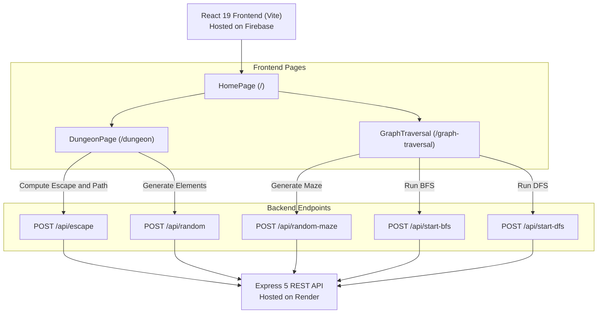

# 🏰 Monster Labyrinth: Multi-Source Pathfinding & Graph Traversal Visualizer

[](https://react.dev/)
[](https://vitejs.dev/)
[](https://nodejs.org/)
[](https://dungeon-laybriths.web.app)
[](https://monster-labyrinth.onrender.com)

An interactive, animated full-stack web application for exploring and visualizing complex graph algorithms, multi-source Breadth-First Search (BFS), and classical graph traversal techniques (BFS vs. DFS) in grid-based environments.

---

## 🌐 Live Deployments

- **Frontend Application (Firebase Hosting):** [https://dungeon-laybriths.web.app](https://dungeon-laybriths.web.app)
- **Backend API Server (Render):** [https://monster-labyrinth.onrender.com](https://monster-labyrinth.onrender.com)
- **GitHub Repository:** [Kathir2828/Monster_Labyrinth](https://github.com/Kathir2828/Monster_Labyrinth)

---

## 🎯 Features & Modules

### 1. ⚔️ Dungeon Escape Visualizer (`/dungeon`)
A gamified multi-source graph simulation modeling an adventurer attempting to escape a monster-infested labyrinth:
- **Multi-Source BFS Simulation:** Simultaneous traversal simulation where monsters (Goblins/Orcs) and the human move across the 20x40 grid.
- **Turn-Paced Mechanics:** Monsters advance on coordinated turns while the human searches for reachable exit portals avoiding walls and monsters.
- **Dynamic Board Builder:**
  - Place or remove **Goblins**, **Orcs**, **Obstacle Walls**, **Human Starting Point**, and **Exit Portals**.
  - **Randomize Dungeon:** Procedurally generates walls, monster locations, adventurer starting points, and escape exits.
- **Animated Pathfinding & Traceback:**
  - Visualizes search waves step-by-step in real-time.
  - Highlights the optimal reconstructed escape trajectory if an exit is successfully reached.

### 2. 🔍 BFS vs DFS Pathfinding Visualizer (`/graph-traversal`)
A direct side-by-side comparison of fundamental graph exploration strategies on a 20x40 grid:
- **Breadth-First Search (BFS):** Explores neighbors level-by-level using a queue, guaranteeing the shortest path in unweighted graphs.
- **Depth-First Search (DFS):** Explores as deeply as possible along each branch using a stack before backtracking.
- **Custom Obstacles & Maze Generation:**
  - Draw/toggle custom walls across the board with a single click.
  - Automatically generate random mazes with obstacles.
- **Step-by-Step Traversal Playback:** Controlled animation speed showcasing how each algorithm navigates around barriers from start `(0, 0)` to destination `(19, 39)`.

---

## 🏗️ Architecture & System Overview



#### System Flow Diagram
```text
┌──────────────────────────────────────────────────────────────────┐
│                   React 19 Frontend (Vite)                       │
│              Hosted on: https://dungeon-laybriths.web.app        │
└────────────────────────────────┬─────────────────────────────────┘
                                 │
                 ┌───────────────┴───────────────┐
                 ▼                               ▼
       ┌──────────────────┐            ┌──────────────────┐
       │    /dungeon      │            │ /graph-traversal │
       │  (DungeonPage)   │            │ (GraphTraversal) │
       └────────┬─────────┘            └────────┬─────────┘
                │                               │
  POST /api/escape                              │ POST /api/start-bfs
  POST /api/random                              │ POST /api/start-dfs
                │                               │ POST /api/random-maze
                └───────────────┬───────────────┘
                                │ JSON REST API
                                ▼
┌──────────────────────────────────────────────────────────────────┐
│                     Node.js / Express 5 API                      │
│             Hosted on: https://monster-labyrinth.onrender.com    │
└──────────────────────────────────────────────────────────────────┘
```

### Component Breakdown
- **Frontend (`/frontend`)**:
  - Built with **React 19** and **Vite 8**.
  - **`React.memo` Optimized Grid Cells**: High-performance cell rendering avoiding unneeded re-renders across the 800-cell grid during live drawing.
  - Pure **Vanilla CSS** styling with modern dark theme, glassmorphism toolbars, and neon glow effects.
  - **React Router v7** for seamless client-side page routing.
- **Backend (`/backend`)**:
  - Lightweight **Node.js** and **Express 5** server.
  - Implements custom graph algorithms, multi-source queue evaluations, and procedural generation logic.
  - Real-time response streaming and path history payloads for client-side stepped animations.

---

## 📊 Algorithms Deep Dive

### 1. Multi-Source BFS (`/api/escape`)
The escape algorithm utilizes a multi-queue variant of Breadth-First Search:
1. **Source Initialization**: Goblins and Orcs are loaded into queue $Q_1$, while the human adventurer is loaded into queue $Q_2$.
2. **Turn-Based Expansion**:
   - Monsters advance in alternating turns (1 step per 2 ticks), marking traversed cells as visited and blocking future human steps.
   - The human expands into all 4 cardinal directions ($[-1,0], [1,0], [0,-1], [0,1]$) across non-wall and non-visited cells.
   - For each human movement, direction vectors are indexed in a 2D matrix for path reconstruction.
3. **Exit Resolution**:
   - If an exit node is discovered, the loop terminates.
   - The path is reconstructed by walking backwards through the direction matrix to the starting node and reversing the sequence.

### 2. Standard BFS vs. DFS (`/api/start-bfs` & `/api/start-dfs`)
- **BFS (Queue-based / FIFO):** Visited nodes are shifted in order of arrival, expanding uniformly like a ripple wave.
- **DFS (Stack-based / LIFO):** Visited nodes are pushed and popped, driving deep down corridors until an obstacle is hit, illustrating classic exploration behavior.

---

## 📁 Repository Structure

```text
multi-source-visualizer/
├── backend/
│   ├── routes/
│   │   └── dungeon.js         # BFS, DFS, Multi-source escape & procedural generators
│   ├── .gitignore
│   ├── package.json           # Express 5, CORS, Nodemon
│   └── server.js              # Express server setup, CORS configuration, logging
├── frontend/
│   ├── public/
│   │   └── favicon.svg
│   ├── src/
│   │   ├── pages/
│   │   │   ├── Cell.css       # Cell color coding (Wall, Human, Monster, Exit)
│   │   │   ├── Cell.jsx       # Individual grid cell component (React.memo)
│   │   │   ├── DungeonPage.css
│   │   │   ├── DungeonPage.jsx # Multi-source escape visualizer page
│   │   │   ├── GraphTraversal.css
│   │   │   ├── GraphTraversal.jsx # BFS vs DFS traversal visualizer page
│   │   │   ├── HomePage.css
│   │   │   └── HomePage.jsx   # Landing page navigation
│   │   ├── App.css
│   │   ├── App.jsx            # Router configuration
│   │   ├── index.css          # Global typography, layout, and reset styles
│   │   └── main.jsx           # React DOM root entry
│   ├── .firebaserc            # Firebase project configuration
│   ├── firebase.json          # Firebase hosting rewrite rules
│   ├── index.html
│   ├── package.json           # React 19, React Router 7, Vite 8
│   └── vite.config.js         # Vite configuration
└── README.md
```

---

## 🚀 Getting Started Locally

### Prerequisites
- [Node.js](https://nodejs.org/) (v18.0.0 or higher recommended)
- `npm` or `yarn`

### 1. Clone the Repository
```bash
git clone https://github.com/Kathir2828/Monster_Labyrinth.git
cd Monster_Labyrinth
```

### 2. Backend Setup
```bash
cd backend
npm install
npm start
```
The backend server will run on `http://localhost:3000`.

### 3. Frontend Setup
In a new terminal window:
```bash
cd frontend
npm install
npm run dev
```
Open your browser and navigate to `http://localhost:5173`.

> **Note on Local Development**: By default, the frontend points to the remote Render backend (`https://monster-labyrinth.onrender.com`). To point the frontend to your local backend (`http://localhost:3000`), update the fetch URLs or configure a `.env` file with `VITE_API_URL=http://localhost:3000`.

---

## 📡 API Reference

All backend routes are mounted under the `/api` prefix.

| Method | Endpoint | Description | Request Body | Response Payload |
|---|---|---|---|---|
| `POST` | `/api/random` | Randomizes a full dungeon board with walls, goblins, human, and exits | `{ grid }` | `{ grid }` |
| `POST` | `/api/random-maze` | Generates a 20% wall density maze between `(0,0)` and `(r-1, c-1)` | `{ grid }` | `{ grid }` |
| `POST` | `/api/start-bfs` | Solves the grid using Breadth-First Search | `{ grid }` | `{ path: [{ i, j }] }` |
| `POST` | `/api/start-dfs` | Solves the grid using Depth-First Search | `{ grid }` | `{ path: [{ i, j }] }` |
| `POST` | `/api/escape` | Computes multi-source monster movements & human escape path | `{ grid }` | `{ escape: boolean, result: [...steps], path: [...path] }` |

---

## 🛠️ Cell State Representation

Each cell on the 20x40 grid carries a multi-element boolean array:

| Index | Entity Type | Class Style | Description |
|---|---|---|---|
| `option[0]` | Goblin | `.cell-goblin` | Fast monster seeking to intercept the adventurer |
| `option[1]` | Orc | `.cell-orc` | Brute monster |
| `option[2]` | Wall | `.cell-wall` / `.wall` | Impassable obsidian stone barrier |
| `option[3]` | Human | `.cell-start` / `.start` | Adventurer starting position |
| `option[4]` | Exit | `.cell-exit` / `.end` | Target escape portal |

---

## 🌟 Future Enhancements

- [ ] **Algorithm Expansion:** Add Dijkstra's Algorithm, A* (A-Star) with Manhattan/Euclidean heuristics, and Bidirectional BFS.
- [ ] **Speed Control Slider:** Enable dynamic user adjustment of animation speeds.
- [ ] **Interactive Legend & Metrics:** Display live step counters, path cost, nodes explored, and execution time comparison cards.
- [ ] **Environment Variable Integration:** Centralize backend URL configurations using `import.meta.env.VITE_API_BASE_URL`.
- [ ] **Mobile Responsiveness:** Implement canvas-based rendering or pinch-to-zoom for small mobile viewports.

---

## 📄 License

This project is licensed under the [ISC License](LICENSE).
